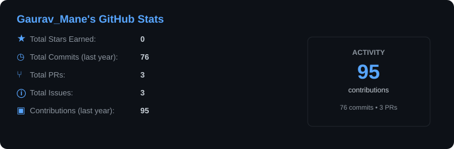
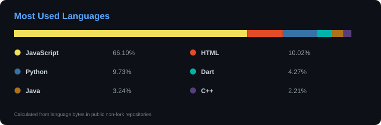
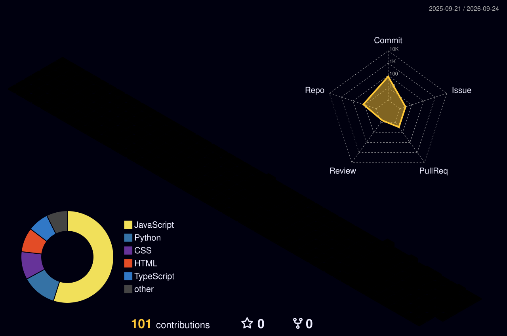

<div align="center">

# 👋 GAURAV MANE

### 💻 C++ • DSA • Full-Stack • AI • Open Source


</div>

---

# 🧭 ABOUT ME

🎓 B.Tech Computer Science & Engineering student at **Walchand College of Engineering, Sangli**  
💻 Building practical software with **C++, Java, JavaScript & Python**  
🧠 Solved **420+ algorithmic problems** across LeetCode, CodeChef & Codeforces  
🏆 **CodeChef 2★** • CodeChef Starters 216 — **Global Rank 364**  
🌍 Open-source contributor through **ECSOC**, with a PR successfully reviewed and merged  
⚙️ Interested in **systems programming, backend engineering, databases, AI applications and software engineering**  
🚀 Currently going deeper into **C++, STL, multithreading & concurrency**

---

# 🚀 WHAT I BUILD

> I like turning concepts into working software — from algorithmic problem solving and database-backed applications to AI-powered platforms.

### 🔧 Systems & C++

`C++` · `STL` · `OOP` · `DSA` · `Multithreading` · `Concurrency`

### 🌐 Full-Stack Development

`React.js` · `Node.js` · `Express.js` · `REST APIs` · `PostgreSQL` · `MongoDB`

### 🤖 AI-Powered Applications

`Gemini AI` · `AI Code Review` · `Resume Analysis` · `Skill Gap Detection` · `Computer Vision`

### 🌍 Open Source

`Bug Fixes` · `Feature Development` · `Testing` · `Documentation` · `Issue Discussions` · `Code Review`

---

# 🛠️ TECH STACK

<div align="center">

### Languages


### Frontend


### Backend & Databases


### Tools


</div>

---

# 🚀 MY CREATIONS

## 🧠 SKILL LENS — AI-POWERED CODING ASSESSMENT PLATFORM

### `FULL STACK • AI • CODE EXECUTION • ASSESSMENT`

A full-stack AI-powered coding assessment platform combining automated code evaluation with candidate analysis and career recommendations.

**Tech Stack**

`React.js` · `Node.js` · `Express.js` · `PostgreSQL` · `Supabase` · `Gemini AI`

- ⚙️ Code execution across **5 programming languages**
- 🔌 Designed **37 REST API endpoints**
- 🗄️ Built an **11-table PostgreSQL schema**
- 🤖 AI-powered code reviews, resume analysis, skill-gap detection and job matching
- 🛡️ Assessment integrity features including face detection, plagiarism detection, copy-paste tracking and tab-switch monitoring

🔗 **[View Project](https://github.com/Gauravmane31)**

> Replace the link above with the exact Skill Lens repository URL if it is hosted under another repository name.

---

## ✈️ AIRLINE RESERVATION SYSTEM

### `JAVA • JDBC • POSTGRESQL • DATABASE SYSTEMS`

A modular airline reservation system designed with a layered architecture and PostgreSQL-backed persistence.

**Tech Stack**

`Java` · `JDBC` · `PostgreSQL`

- 🏗️ Layered architecture with **8 packages and 13 Java classes**
- 🗃️ **15+ JDBC database operations**
- 🔐 Authentication, booking validation and input validation
- ✈️ Flight search, reservations, cancellations and customer management
- 🛡️ Duplicate reservation prevention and overbooking control

🔗 **[View Project](https://github.com/Gauravmane31)**

> Replace the link above with the exact Airline Reservation repository URL if it is hosted under another repository name.

---

## 📦 ACSES INVENTORY MANAGEMENT SYSTEM

### `C++ • OOP • DATA STRUCTURES`

A C++ project developed for inventory management workflows.

**Tech Stack**

`C++` · `OOP` · `STL`

🔗 **[View Repository](https://github.com/Gauravmane31/Inventory_Management)**

---

# 🌍 OPEN SOURCE

I believe strong software engineering comes from **reading real code, understanding existing systems, discussing design decisions and contributing improvements**.

### My Contribution Focus

```text
🐛 Bug Fixes
✨ Feature Development
🧪 Testing & Debugging
📝 Documentation
🔍 Code Review
💡 Issue Discussions
```

### ECSOC

🤝 **ECSOC Open Source Contributor**

Contributed through a pull request that was successfully **reviewed and merged by project maintainers**.

> As my contribution history grows, this section will become a record of real PRs, issues and project contributions.

---

# 🧠 COMPETITIVE PROGRAMMING

<div align="center">

| Metric | Achievement |
|---|---:|
| 💻 Problems Solved | **420+** |
| ⭐ CodeChef | **2★** |
| 📈 Codeforces Max Rating | **948** |
| 🥇 CodeChef Starters 216 | **Global Rank 364** |

</div>

### Core Topics

`Arrays` · `Strings` · `Recursion` · `Backtracking` · `Trees` · `Graphs` · `Dynamic Programming` · `Greedy` · `Sorting` · `Searching` · `Bit Manipulation`

---

# 📚 CURRENTLY EXPLORING

```text
C++
├── Modern C++
├── STL
├── Object-Oriented Programming
└── Multithreading & Concurrency

Computer Science
├── Data Structures & Algorithms
├── Operating Systems
├── DBMS
└── Computer Networks

Software Engineering
├── System Design
├── Clean Architecture
├── Testing
└── Open Source Development
```

---

# 🏆 ACHIEVEMENTS

- 🥇 **CodeChef Starters 216 — Global Rank 364**
- ⭐ **CodeChef 2-Star Programmer**
- 💻 **420+ algorithmic problems solved**
- 🌍 Participated in national-level hackathons including **HackFusion 2026** and **RIT Hackathon 2K26**
- 🤝 **ECSOC Open Source Contributor** — PR successfully reviewed and merged
- 🏅 **NPTEL Elite — Understanding Incubation & Entrepreneurship (99%)**
- 🏆 **Microsoft AI Guinness World Record Holder**

---

# 👥 LEADERSHIP

### 🧑‍💻 CodeChef WCE Chapter — Assistant Secretary

Led **15+ student organizers**, coordinated 3+ activities and engaged **200+ students** through programming events and DSA learning sessions.

### 🎯 Association of Computer Science & Engineering Students

Supported recruitment, volunteer onboarding and student-team coordination across club initiatives and major college events.

---

# 📊 GITHUB STATS

<div align="center">





<sub>Cards are generated and refreshed from GitHub API data by the included Actions workflow.</sub>

</div>

---

# 🔥 GITHUB STREAK

<div align="center">


</div>

---

# 🧊 3D CONTRIBUTION GRAPH

<p align="center">
  
</p>

---

# 🐍 CONTRIBUTION SNAKE

<p align="center">
  
</p>

---

# 🎯 WHAT'S NEXT

```text
✓ Strengthen C++ & DSA
✓ Build production-oriented projects
✓ Contribute consistently to open source
→ Deepen multithreading & concurrency
→ Explore system design
→ Build stronger C++ systems projects
→ Grow as an open-source contributor
```

---

# 🤝 CONNECT WITH ME

<div align="center">

[](https://github.com/Gauravmane31)
[](https://www.linkedin.com/in/gaurav-mane19/)
[](mailto:gauravmane4566@gmail.com)

</div>

---

<div align="center">

### 💻 BUILD • LEARN • CONTRIBUTE

**Learn deeply. Build practically. Contribute consistently.**

</div>
